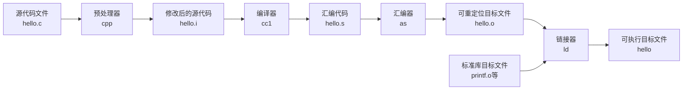

---
tags:
  - CSAPP
---



**程序的生命周期：**
1. **预处理(Pre-processor)**: 处理#include、#define等指令，生成.i文件
2. **编译(Compiler)**: 将C代码翻译成汇编代码，生成.s文件  
3. **汇编(Assembler)**: 将汇编代码翻译成机器码，生成.o目标文件
4. **链接(Linker)**: 将目标文件和库文件合并，生成可执行文件

```bash
# GCC 编译过程示例
gcc -E hello.c -o hello.i    # 仅预处理
gcc -S hello.i -o hello.s    # 编译成汇编
gcc -c hello.s -o hello.o    # 汇编成目标文件
gcc hello.o -o hello         # 链接生成可执行文件

# 或者一步完成
gcc hello.c -o hello
```
